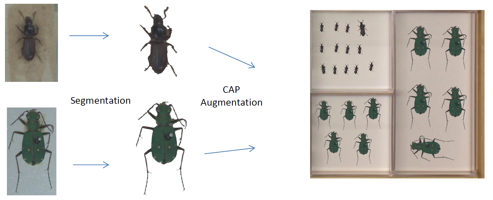
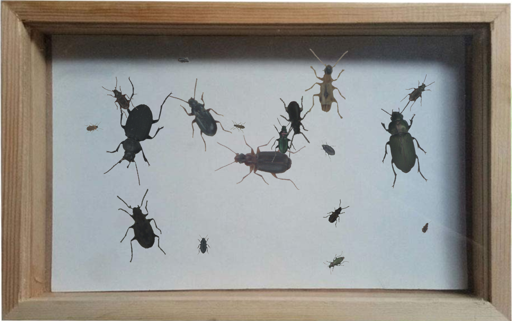
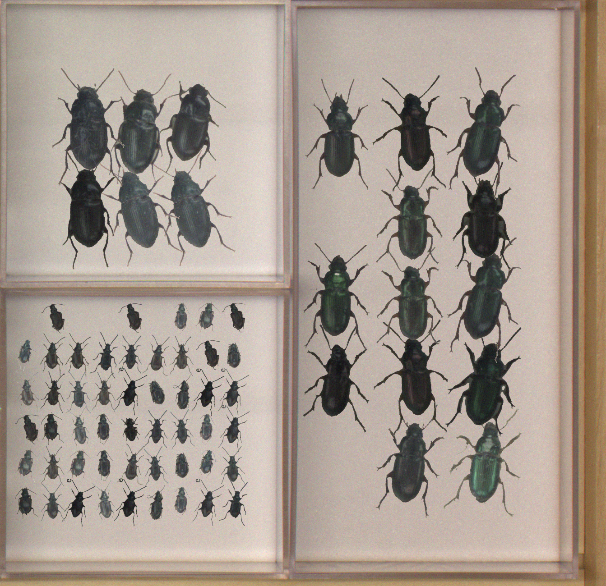
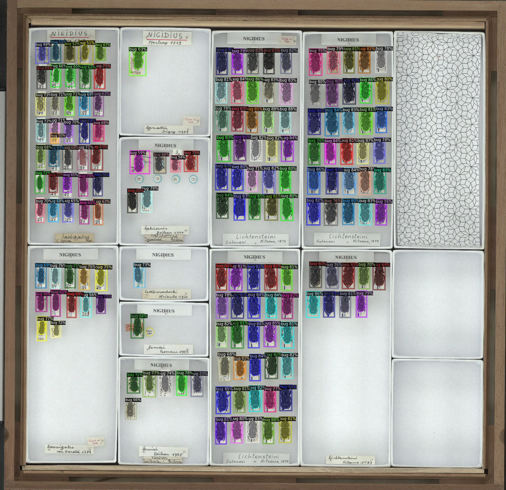
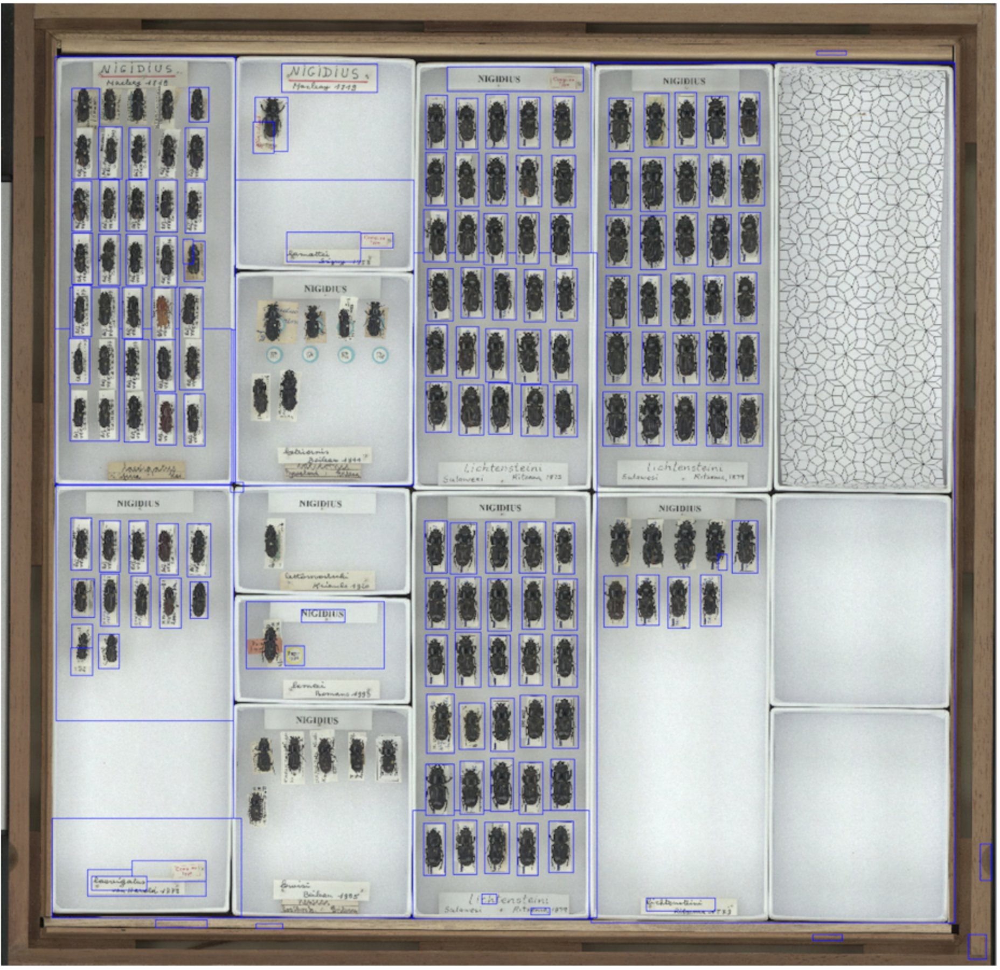

# Copy-and-Paste Augmentation for Insect Detection

This repository is a case study and proof-of-concept for leveraging Copy-and-Paste Augmentation (CPA) to perform object detection and instance segmentation on insect collection boxes (e.g. integrated into [*Inselect*](https://naturalhistorymuseum.github.io/inselect/)). It was a university project of the [Lab "Intelligent Vision Systems"](http://vsteinhage.github.io/HTML/pg.html) during the summer term 2021 at the University of Bonn.

## Basic principle
Instances are obtained from annotated full-sized or pre-cropped images that are recombined in front of a realistic background (in this case different empty collection boxes).

Fully random instance placements (R-CPA, left) and a placement pattern imitating real collection boxes (CB-CPA, right) were implemented.

R-CPA          |  CB-CPA
:-------------------------:|:-------------------------:
 |  

The project was build on [FAIR's *dectron2*](https://github.com/facebookresearch/detectron2) and used the [TensorMask](https://github.com/facebookresearch/detectron2/tree/master/projects/TensorMask) sliding-window instance segmentation model.

## Data
The original data set only consisted of 3 unlabeled images of collection boxes containing bugs. As manual labeling turned out to be unfeasibly labor-intensive, the public dataset of [Hansen et al., 2019](https://zenodo.org/record/3549369#.YVc26JpByUn) containing > 60,000 cropped bug images distributed between a variety of species was used.
This data could be annotated using a rather simple [intensity-based thresholding pipeline](nb/annotation/segment_bugs_from_crops.ipynb) and a [train-test iteration](nb/annotation/Tensormask_bug_seg_2nd_iter.ipynb) of TensorMask (rather an overkill, but the code was already there...).
The created annotations are available [here](https://drive.google.com/drive/folders/1enNtE0Lali2pSQX9vlUsgy130SLXieiq?usp=sharing). These instances were used for training, whereas the partially annotated collection-box images were used for validation.

## Results

### quantitative results 
The validation accuracies obtained using differnt CPA and training settings on the annotated crops (crop) and iamges imitating full-sized collection-box images (stitch) from the 3 validation images are as follows:
<table><thead><tr><th>setting</th><th>CB-CAP prob</th><th>R-CAP prob</th><th>LR</th><th>BN momemtum</th><th>poolsize</th><th>additional modification</th><th>segm. AP crop</th><th>bbox AP crop</th><th>segm. AP stitch</th><th>bbox AP stitch</th></tr></thead><tbody><tr><td>base</td><td>0.5</td><td>0.5</td><td>0.001</td><td>0.9</td><td>15</td><td></td><td>56.7</td><td>70.5</td><td>27.1</td><td>36.3</td></tr><tr><td>lower LR</td><td>0.5</td><td>0.5</td><td>0.0002</td><td>0.99</td><td>15</td><td>reduced LR (0.0002) and increased BN momentum (0.99)</td><td>60.5</td><td>69.4</td><td>28.2</td><td>34.6</td></tr><tr><td>R-CAP only</td><td>0</td><td>1</td><td>0.001</td><td>0.9</td><td>30</td><td></td><td>56.7</td><td>67.2</td><td>27.6</td><td>34.6</td></tr><tr><td>CB-CPA only</td><td>1</td><td>0</td><td>0.001</td><td>0.9</td><td>30</td><td></td><td>55.6</td><td>68.7</td><td>27.3</td><td>37</td></tr><tr><td>alpha blending</td><td>0.5</td><td>0.5</td><td>0.001</td><td>0.9</td><td>15</td><td>alpha blending added to CB-CPA</td><td>58.3</td><td>70.9</td><td>27.3</td><td>36.5</td></tr><tr><td>scale augm.</td><td>0.5</td><td>0.5</td><td>0.001</td><td>0.9</td><td>15</td><td>scale CB- and R-CPA instances by a factor drawn from [0.85, 1.175] and&nbsp;&nbsp;&nbsp;[0.6, 1.66], respectively</td><td>58.5</td><td>70.2</td><td>27.2</td><td>36</td></tr><tr><td>small train set (1)</td><td>0.5</td><td>0.5</td><td>0.001</td><td>0.9</td><td>3</td><td></td><td>57.5</td><td>69.2</td><td>27.5</td><td>36.2</td></tr><tr><td>small train set (2)</td><td>0.5</td><td>0.5</td><td>0.001</td><td>0.9</td><td>3</td><td>5-fold increased count of augmentations per instance</td><td>58.4</td><td>69.9</td><td>27.4</td><td>36.2</td></tr></tbody></table>

For more detailed explanations and results see the [report](report/Instance_Segmentation_on_Large_Scale_Images-ISS-report-Sebastian_Rassmann-2021.pdf).

### qualitative results

All obtained models generalized very well to the [beetle data published alongside *Inselect*](https://data.nhm.ac.uk/dataset/images-for-the-evaluation-of-automatic-image-segmentation-algorithms), however, no ground truth and quantitative scores of *Inselect's* current object detection methods are provided.

CB-CPA trained TensorMask model            |  *Inselect*
:-------------------------:|:-------------------------:
  |  

